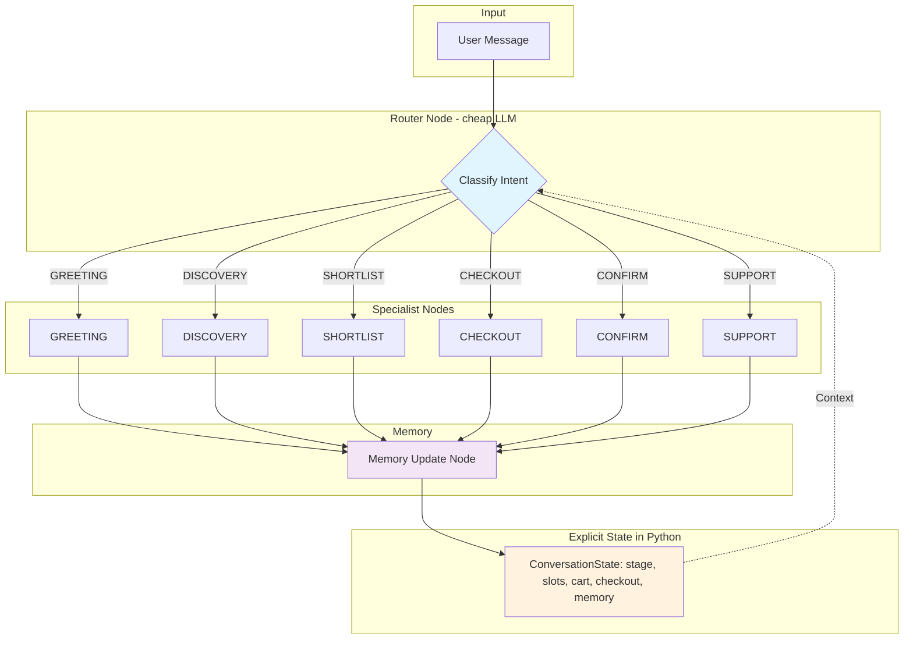
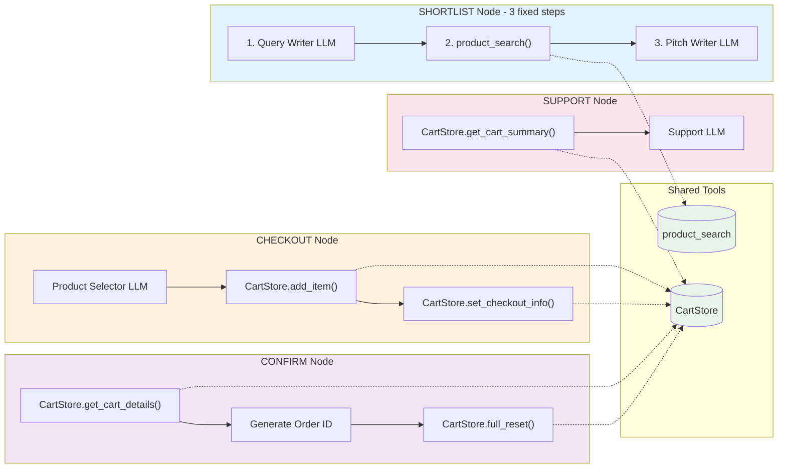
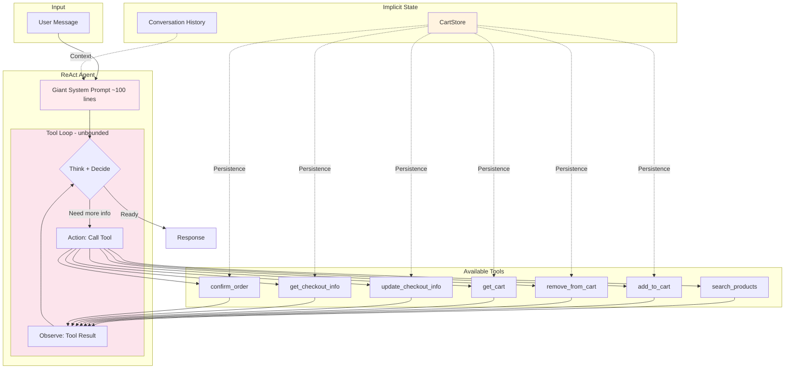

# Catalog Seller Chatbot - Architecture Comparison POC

A proof-of-concept comparing two LLM agent architectures for e-commerce chatbots:

1. **Stage Routing + Specialists** - LangGraph state machine with focused specialist prompts
2. **ReAct Agent** - Single agent with one giant prompt and tool loop

Includes an **automated evaluation system** with an LLM judge to objectively compare both approaches.

## Quick Start

```bash
# Install dependencies
uv venv && uv pip install -e .

# Create .env file with your OpenAI API key
echo "OPENAI_API_KEY=sk-your-key-here" > .env

# Run interactive chatbot (stage-routing mode)
uv run python main.py

# Run interactive chatbot (ReAct mode)
uv run python main.py --react

# Run automated comparison evaluation
uv run python main.py --eval --compare -v
```

## Architecture Comparison

### Stage Routing (Default)

The Stage Routing approach uses a **state machine with specialized nodes**. A cheap router LLM classifies each user message and routes to exactly ONE specialist per turn. Each specialist has a focused prompt (~20-30 lines) and performs bounded, predictable work. State is explicitly managed in code, not in the LLM context window.



**Key characteristics:**
- **Bounded execution**: Router → ONE Specialist → Memory Update → END (per turn)
- **Predictable LLM calls**: Known number of calls per turn (typically 2-3)
- **Explicit state transitions**: Stage enum controls flow
- **Small, focused prompts**: Each specialist has ~20-30 line prompt

#### Detailed View: Specialist Nodes with Tool Calls

Each specialist performs **bounded, deterministic work** - the tool calls are hardcoded in the node logic, not decided by the LLM in a loop.

Unlike ReAct where the LLM decides which tools to call and when, here the Python code defines a fixed sequence of steps per node. For example, SHORTLIST always runs: (1) LLM generates search query → (2) `product_search()` executes → (3) LLM writes the pitch. This makes behavior predictable, debuggable, and cost-controlled since you know exactly how many LLM calls and tool invocations happen per turn.



**Key difference from ReAct**: Tool calls are **hardcoded in each node's Python code**, not decided by the LLM. The LLM only generates text/JSON; the orchestration is deterministic.

### ReAct Agent

The ReAct approach uses a **single agent with one comprehensive prompt** (~100 lines) that handles all scenarios. The agent has access to tools and can call them in an open-ended loop until it decides to respond. State is managed implicitly in the conversation history.



**Key characteristics:**
- **Open-ended execution**: Agent decides when to stop (unpredictable calls)
- **Single comprehensive prompt**: Must cover all scenarios and edge cases
- **Implicit state**: LLM tracks context through conversation history
- **Tool-based actions**: All operations via tool calls

### Trade-offs

| Aspect | Stage Routing | ReAct |
|--------|---------------|-------|
| Token usage | **Lower** (~60% less), predictable | Higher, varies with tool loops |
| Flexibility | Requires engineering new stages | Natural handling of edge cases |
| Debugging | Easy (stage traces, explicit state) | Harder (must trace tool loops) |
| Edge cases | Must be coded/anticipated | LLM can improvise |
| Prompt size | Small, focused (~20-30 lines each) | Large, comprehensive (~100 lines) |
| State management | Explicit in code | Implicit in conversation |

### Token Usage Tracking

Both implementations track token consumption at the LLM call level by extracting `token_usage` from LangChain's `response_metadata`. The `total_tokens` metric is the sum of **prompt tokens** (input sent to the LLM) and **completion tokens** (output generated by the LLM). Each call accumulates into `state.total_tokens`, which flows through the entire conversation. The evaluation reports (in `evaluations/`) compare total tokens, LLM calls, and tool calls side-by-side, making it easy to see the cost difference between approaches.

## Evaluation Results Summary

The evaluation system ran multiple test scenarios comparing both approaches over time. Below is a summary of how the systems evolved and performed.

### Evolution Timeline (Jan 25, 2026)

| Time | Stage-Routing | ReAct | Key Finding |
|------|---------------|-------|-------------|
| 18:48 | ❌ 50% | ✅ 100% | SR failed: naive string matching added wrong items |
| 18:56 | ❌ 25% | ✅ 100% | SR cart had 5 items instead of 3 (1716 vs 938 PEN) |
| 19:06 | ✅ 100% | ✅ 100% | **Fix applied**: LLM-based product selector |
| 19:35 | 25% (2/8) | 0% (0/8) | Full suite: both struggled with edge cases |
| 20:28 | ✅ 100% (2/2) | 50% (1/2) | Final: SR more reliable after fixes |

### Key Findings

1. **Token Efficiency**: Stage-Routing consistently used **50-70% fewer tokens** across all runs
2. **Reliability**: Stage-Routing improved from 25% → 100% with targeted fixes; ReAct remained inconsistent
3. **Common Failure**: Both struggled with "Urban Commuter" vs "Urban Daily" product disambiguation
4. **ReAct Weakness**: Payment method normalization ("transfer" vs "Bank Transfer" vs "card")

### Critical Fix: LLM-Based Product Selection

The initial Stage-Routing implementation used naive string matching for cart operations:
- `"both" in message` → added ALL shown products
- Word matching was too aggressive

**Solution**: Replaced with a focused LLM prompt (`PRODUCT_SELECTOR_SYSTEM_PROMPT`) that parses exactly which products the user requested. Added ~1,400 tokens per checkout but achieved 100% accuracy while still using 63% fewer tokens than ReAct.

## Project Structure

```
.
├── main.py                 # CLI entry point
├── catalog.json            # Product catalog (32 items)
├── .env                    # API keys (create this)
│
├── src/                    # STAGE ROUTING implementation
│   ├── state.py            # ConversationState with explicit stages
│   ├── prompts.py          # Focused prompts for each specialist
│   ├── nodes.py            # LangGraph node implementations
│   ├── graph.py            # Graph wiring
│   ├── tools.py            # Product search
│   ├── catalog.py          # Catalog loading
│   └── colors.py           # Terminal color utilities
│
├── src_react/              # REACT implementation
│   ├── state.py            # Simple state tracking
│   ├── tools.py            # LangChain tools
│   └── react_agent.py      # Single agent with giant prompt
│
├── src_eval/               # AUTOMATED EVALUATION SYSTEM
│   ├── scenarios.py        # Test scenarios (customer scripts)
│   ├── judge.py            # LLM judge that simulates customers
│   ├── runner.py           # Evaluation executor
│   └── report.py           # Markdown report generator
│
└── evaluations/            # Generated evaluation reports (*.md)
```

## CLI Reference

### Interactive Mode

```bash
# Stage-routing (default)
uv run python main.py
uv run python main.py --mode stage-routing

# ReAct mode
uv run python main.py --react
uv run python main.py --mode react

# With colored output
uv run python main.py --color
uv run python main.py --react --color

# Disable colors (for CI/piping)
uv run python main.py --no-color
```

### Evaluation Mode

```bash
# Compare both modes on default scenario
uv run python main.py --eval --compare

# Verbose output (see conversation)
uv run python main.py --eval --compare -v

# Specific scenario
uv run python main.py --eval --scenario simple_shoe --compare

# Single mode evaluation
uv run python main.py --eval --mode react
uv run python main.py --eval --mode stage-routing

# List available scenarios
uv run python main.py --list-scenarios
```

### Available Scenarios

| ID | Description |
|----|-------------|
| `headphones_multi` | Buy 3 headphones, ask for total, complete checkout |
| `simple_shoe` | Simple single shoe purchase |
| `category_switch` | Start with shoes, switch to backpacks |

## Automated Evaluation System

The evaluation system uses an **LLM judge** that:

1. **Follows a script**: Simulates a customer with specific intents
2. **Retries**: If bot doesn't understand, rephrases up to 3 times
3. **Moves on**: If stuck, continues with whatever works
4. **Evaluates**: Checks cart correctness, total, order confirmation
5. **Explains**: Provides 2-sentence analysis of why it passed/failed

### Evaluation Output

```
======================================================================
COMPARISON SUMMARY
======================================================================

Mode             Status     Score    Tokens       LLM Calls 
----------------------------------------------------------------------
Stage-Routing    PASSED     100%     8,234        12        
ReAct            PASSED     100%     29,486       15        
----------------------------------------------------------------------

Stage-Routing used 72% fewer tokens

Judge Analysis:
  Stage-Routing: Order confirmed with correct items and total...
  ReAct: Successfully completed purchase with all 3 headphones...
======================================================================
```

### Evaluation Reports

Reports are saved to `evaluations/` as markdown files:

- `headphones_multi_purchase_comparison_20260125_185608.md`
- Individual mode reports also available

## Environment Variables

```env
# Required
OPENAI_API_KEY=sk-your-key-here

# Optional - LangSmith tracing
LANGCHAIN_TRACING_V2=true
LANGCHAIN_API_KEY=your-langsmith-key
LANGCHAIN_PROJECT=catalog-chatbot-poc
```

## Extending

### Add a new scenario

Edit `src_eval/scenarios.py`:

```python
SCENARIO_NEW = Scenario(
    name="My New Scenario",
    description="What this tests",
    steps=[
        ScenarioStep(
            intent="What customer wants",
            example_message="Example of what they say",
        ),
        # ... more steps
    ],
    expected=ExpectedOutcome(
        cart_items=["Product1", "Product2"],
        total_price=500.0,
        order_confirmed=True,
    ),
)

SCENARIOS["my_new"] = SCENARIO_NEW
```

### Modify prompts

- Stage routing: `src/prompts.py`
- ReAct: `src_react/react_agent.py` (REACT_SYSTEM_PROMPT)

### Add products

Edit `catalog.json` directly or delete it to regenerate.
