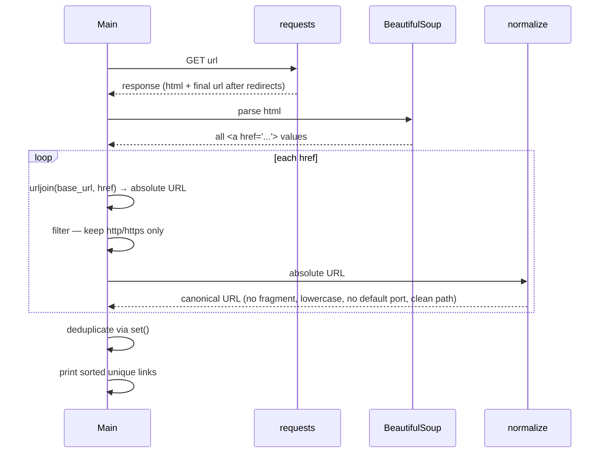

# v0 — Hello Web Crawler

Single-URL link extractor. Fetches a page, parses all `<a>` tags, resolves relative hrefs to absolute URLs, normalizes them to a canonical form, and prints the deduplicated set.

## What normalization does

| Step | Example |
|------|---------|
| Resolve relative → absolute | `/about` → `https://example.com/about` |
| Remove fragment | `https://a.com/x#section` → `https://a.com/x` |
| Lowercase scheme + host | `HTTPs://EXAMPLE.com` → `https://example.com` |
| Strip default port | `https://a.com:443/x` → `https://a.com/x` |
| Collapse `.` / `..` in path | `/a/b/../c` → `/a/c` |

## Flow



## Run

```bash
uv run main.py
```
